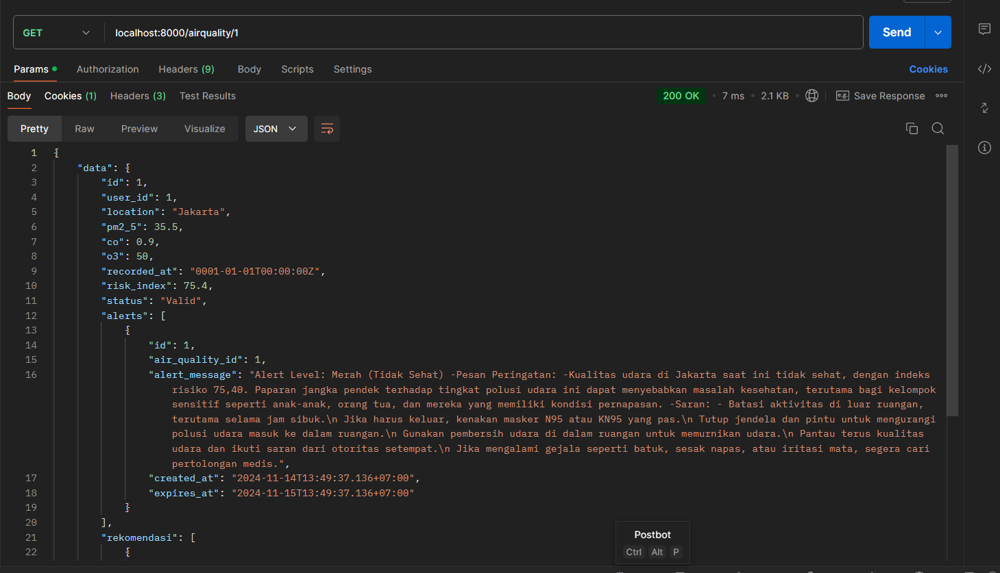

# Project Mini Golang Airquality

API ini adalah proyek mini yang dibuat dengan Golang untuk memantau dan mengelola data kualitas udara. API ini memungkinkan pengguna untuk melakukan registrasi, login, dan mengakses data kualitas udara berdasarkan lokasi atau rekomendasi.

---

## Daftar Isi
1. [ERD (Entity-Relationship Diagram)](#erd-entity-relationship-diagram)
2. [HLA (High-Level Architecture)](#hla-high-level-architecture)
3. [Documentation List API](#documentation-list-api)
4. [Contoh Hasil](#contoh-hasil)
5. [Cara Instalasi](#cara-instalasi)
6. [Cara Penggunaan](#cara-penggunaan)

---

## ERD (Entity-Relationship Diagram)
Berikut adalah ERD yang menjelaskan tabel dan hubungan antar entitas pada database proyek ini:


---

## HLA (High-Level Architecture)
Berikut adalah arsitektur dari API ini:


---

## Documentation List API

Berikut adalah daftar endpoint API yang tersedia dalam sistem ini:

| Method | Endpoint                    | Description                                    |
|--------|-----------------------------|------------------------------------------------|
| POST   | `/login`                    | Login pengguna dan mendapatkan token           |
| POST   | `/register`                 | Registrasi pengguna baru                       |
| GET    | `/logout`                   | Logout pengguna dari sistem                    |
| POST   | `/airquality`               | Menambahkan data kualitas udara baru           |
| GET    | `/airquality`               | Mendapatkan semua data kualitas udara          |
| GET    | `/airquality/{id}`          | Mendapatkan data kualitas udara berdasarkan ID |
| PUT    | `/airquality/{id}`          | Memperbarui data kualitas udara berdasarkan ID |
| DELETE | `/airquality/{id}`          | Menghapus data kualitas udara berdasarkan ID   |
| GET    | `/airquality/alert`         | Mendapatkan data alert kualitas udara          |
| GET    | `/airquality/rekomendasi`   | Mendapatkan rekomendasi kualitas udara         |

---

## Contoh Hasil API
Berikut adalah contoh hasil dari masing-masing endpoint API:

### 1. Registrasi


### 2. Login


### 3. Tambah Data Kualitas Udara


### 4. Mendapatkan Semua Data Kualitas Udara


### 5. Mendapatkan Data Kualitas Udara Berdasarkan ID


### 6. Memperbarui Data Kualitas Udara


### 7. Menghapus Data Kualitas Udara


### 8. Mendapatkan Data Alert


### 9. Mendapatkan Rekomendasi Kualitas Udara


### 10. Logout


---

## Cara Instalasi

Ikuti langkah-langkah berikut untuk menginstal dan menjalankan API ini di mesin lokal Anda:

1. **Clone repository:**
   ```bash
   git clone https://github.com/Barmono-Berutu/Barmono_Berutu_Golang_Mini_Project.git
2. **Sebelum menjalankan kode, jalankan perintah ini terlebih dahulu:**
   ```bash
   cp .env.example .env
3. **Setelah mengubah semua data yang ada di .env, silakan jalankan kode:**
   ```bash
   go run main.go
